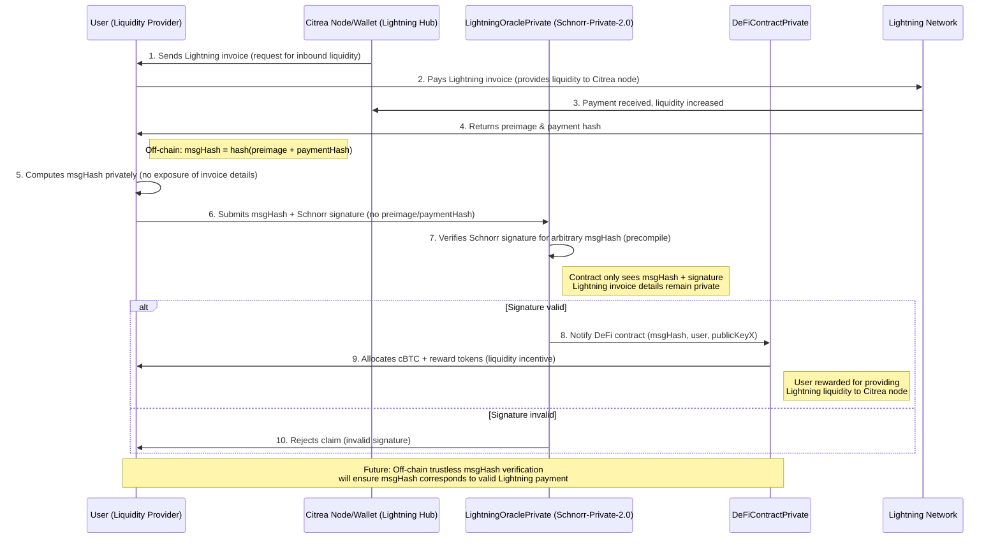

# T-REX Protocol

**Mining Lightning Liquidity for ZKRollup EVM (Citrea) Node Hubs**

T-REX protocol enables secure, private, and gas-efficient cross-chain liquidity mining between the Lightning Network and Citrea EVM ZkRollups. The protocol incentivizes users to provide Lightning Network liquidity to Citrea node hubs, creating a symbiotic relationship between Lightning routing and DeFi rewards.

**✅ Success Transaction - verifyPaymentProof (Schnorr Signatures):**


**Schnorr Signature Verification for Trustless HTLC Swaps using Precompile 0x200:**

- **Transaction Hash**: [`0x80e956cd2ec4a831688526eb0ef3d0956684b9dc9a2a333f3574ab27b69ef3ca`](https://explorer.testnet.citrea.xyz/tx/0x80e956cd2ec4a831688526eb0ef3d0956684b9dc9a2a333f3574ab27b69ef3ca) 
- **Method**: `verifyPaymentProof`
- **Contract**: `LightningOraclePrivate`
- **Precompile Used**: `0x0200` (Schnorr Signature Verification)
- **Tokens Minted**: `0.0000000000000001 TREX` (2 separate mints)
- **Block**: `16112252` | **Confirmations**: `788+`
- **Timestamp**: `Sep 28 2025 07:54:48 AM (+05:30 UTC)`

This transaction demonstrates the successful implementation of **trustless HTLC swaps** using Citrea's native Schnorr signature precompile, enabling privacy-preserving Lightning Network payment verification without exposing sensitive payment details on-chain.


## 🚀 Deployment

### Citrea Testnet (Live)

**✅ Deployed and Verified on Citrea Testnet (Chain ID: 5115):**

**Core Contracts:**

- **TrexToken**: [`0x94c17DD37ED3Ca85764b35BfD4d1CCc543b1bE3E`](https://explorer.testnet.citrea.xyz/address/0x94c17DD37ED3Ca85764b35BfD4d1CCc543b1bE3E) ✅ Verified (Sourcify + Blockscout)
- **LightningOraclePrivate**: [`0xc36B6BFa0ce8C6bdD8efcCd23CeC2E425768f64a`](https://explorer.testnet.citrea.xyz/address/0xc36B6BFa0ce8C6bdD8efcCd23CeC2E425768f64a) ✅ Verified (Sourcify + Blockscout)
- **DeFiContractPrivate**: [`0x90e97EF730B28B14b3F5f9214f47312796b6c10e`](https://explorer.testnet.citrea.xyz/address/0x90e97EF730B28B14b3F5f9214f47312796b6c10e) ✅ Verified (Sourcify + Blockscout)

**Legacy Contracts:**

- **LightningOracle**: [`0x4a95E7e42c968A6c7BFBBb2F2AA908463B46059E`](https://explorer.testnet.citrea.xyz/address/0x4a95E7e42c968A6c7BFBBb2F2AA908463B46059E) ✅ Verified (Sourcify + Blockscout)
- **DeFiContract**: [`0x9d24c52916A14afc31D86B5Aa046b252383ee444`](https://explorer.testnet.citrea.xyz/address/0x9d24c52916A14afc31D86B5Aa046b252383ee444) ✅ Verified (Sourcify + Blockscout)

**Network Details:**

- **RPC URL**: `https://rpc.testnet.citrea.xyz`
- **Explorer**: `https://explorer.testnet.citrea.xyz`

### Local Development

```bash
cd trex-contracts
forge script script/DeployTrexContracts.s.sol --rpc-url anvil --broadcast
```

## 🎯 Core Concept

**Liquidity Mining from Lightning to Citrea**

The Trex protocol revolves around **mining liquidity** from the Lightning Network to Citrea node hubs. Here's how it works:

1. **Citrea Node Hubs** need inbound Lightning liquidity to:

   - Route Lightning payments efficiently
   - Participate in Lightning Network routing
   - Enable seamless Bitcoin-to-DeFi bridges

2. **Users (Liquidity Providers)** provide Lightning liquidity by:

   - Paying Lightning invoices generated by Citrea nodes
   - Increasing the node's inbound channel capacity
   - Enabling the node to route more transactions

3. **Protocol Incentives** reward liquidity providers with:
   - **cBTC tokens** (Citrea-wrapped Bitcoin)
   - **Reward tokens** (protocol-specific incentives)
   - **Bonus multipliers** for high liquidity contributions

## 🔒 Privacy-First Approach

T-REX implements **Schnorr-Private-2.0**, a privacy-preserving approach that:

- **Keeps Lightning invoice details off-chain**: No preimage or payment hash exposure
- **Uses arbitrary message hashes**: Computed privately from payment details
- **Verifies Schnorr signatures trustlessly**: Using Citrea's native precompiles
- **Maintains complete invoice privacy**: Lightning payment details never exposed on-chain

## 🏗️ Architecture

### Smart Contracts

#### Original Version (Public)

- **LightningOracle.sol**: Verifies Lightning payments with full transparency
- **DeFiContract.sol**: Executes actions based on verified payments

#### Schnorr-Private-2.0 (Private)

- **LightningOraclePrivate.sol**: Privacy-preserving oracle with arbitrary msgHash verification
- **DeFiContractPrivate.sol**: Incentive contract for liquidity providers

### Lightning Client Integration

- **OracleServicePrivate**: Backend service for privacy-preserving verification
- **OracleManagerPrivate**: Frontend utilities for client integration
- **Complete API**: RESTful endpoints for private oracle operations

## 🔄 Protocol Flow

### Schnorr-Private-2.0 Sequence



## 🚀 Key Features

### Privacy-Preserving Verification

- **Arbitrary msgHash**: Contract treats message hash as opaque data
- **Off-chain computation**: Lightning details never exposed on-chain
- **Schnorr signature verification**: Trustless verification using Citrea precompiles

### Incentive Mechanisms

- **cBTC allocation**: 1:1 Bitcoin-to-cBTC conversion for liquidity providers
- **Reward tokens**: Additional protocol incentives
- **Bonus multipliers**: Higher rewards for significant liquidity contributions
- **Protocol statistics**: Track total rewards and liquidity providers

### Technical Advantages

- **Gas efficient**: Optimized for Citrea's Schnorr precompile
- **Scalable**: Supports high-volume Lightning routing
- **Interoperable**: Works with existing Lightning infrastructure
- **Future-proof**: Compatible with Lightning PTLCs (Point Time-Locked Contracts)

## 📊 Protocol Statistics

The protocol tracks comprehensive statistics:

- **Total cBTC allocated** to liquidity providers
- **Total reward tokens distributed**
- **Number of liquidity providers** rewarded
- **Individual user statistics** (balances, liquidity provided)

## 🔧 Integration

### For Developers

```javascript
import { OracleManagerPrivate } from "./utils/OracleManagerPrivate.js";

const oraclePrivate = new OracleManagerPrivate();

// Complete private verification flow
const result = await oraclePrivate.completePrivateVerificationFlow({
  paymentHash: "0x...",
  preimage: "0x...",
  privateKey: "0x...",
  publicKeyX: "0x...",
  userAddress: "0x...",
});
```

### API Endpoints

- `POST /api/oracle-private/create-msg-hash` - Create private message hash
- `POST /api/oracle-private/verify` - Verify payment proof (private)
- `GET /api/oracle-private/user/:address/stats` - User statistics
- `GET /api/oracle-private/protocol/stats` - Protocol statistics

## 🌟 Benefits

### For Lightning Users

- **Earn rewards** for providing liquidity
- **Privacy preserved** - invoice details never exposed
- **Trustless verification** - no intermediaries required
- **Seamless integration** - works with existing Lightning wallets

### For Citrea Node Operators

- **Increased liquidity** for routing
- **Better network participation** in Lightning routing
- **Incentivized growth** through protocol rewards
- **Enhanced Bitcoin-DeFi bridges**

### For the Ecosystem

- **Improved Lightning Network liquidity** distribution
- **Enhanced Bitcoin-DeFi interoperability**
- **Privacy-preserving DeFi** innovations
- **Scalable Lightning routing** incentives

## 🔮 Future Enhancements

- **Off-chain trustless verification**: Ensure msgHash corresponds to valid Lightning payments
- **Lightning PTLC integration**: Support for Point Time-Locked Contracts
- **Advanced incentive mechanisms**: Dynamic reward structures
- **Cross-chain liquidity pools**: Multi-network liquidity mining


## 📚 Documentation

- [Smart Contracts Documentation](./trex-contracts/README.md)
- [Lightning Client Integration](./lightning-client/README.md)
- [API Documentation](./lightning-client/API.md)

## 🏆 Vision

T-REX envisions a future where Lightning Network liquidity seamlessly flows into DeFi ecosystems, creating a robust, private, and incentive-aligned bridge between Bitcoin's Lightning Network and Citrea's DeFi infrastructure. By mining liquidity from Lightning to Citrea node hubs, we're building the foundation for a truly decentralized and efficient Bitcoin-DeFi economy.

---

**T-REX Protocol** - Mining Lightning Liquidity for a Better DeFi Future ⚡🔗
